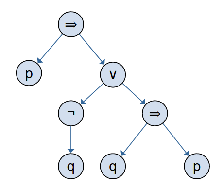
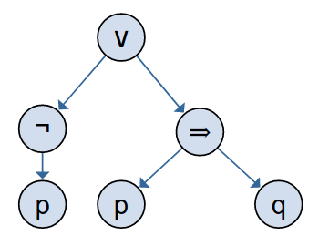
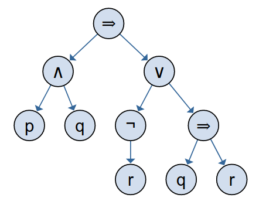

### Task 1 ###

1.  - p = John was jealous of Jane
	- q = John was in a good mood

	`p ∨ ¬q`

2.  - p = Smith has installed central heating
    - q = Smith has sold his car
    - r = Smith has paid his mortgage

	`p ⇒ (q ∨ ¬r)`

3.  - p = The barometer falls
    - q = It will rain
    - r = It will snow

	`p ⇒ (q ∨ r)`

### Task 2 ###

1. ((p ⇒ q) ∧ (¬((r ∨ p) ⇒ q)))
2. (p ∨ ((¬q) ⇒ (p ∧ r)))
3. ((p ∨ p) ⇒ (¬q))

### Task 3 ###

1.  `(p ∧ q) ∧ r, s ∧ t ⊢ q ∧ s`

	Step | Claim | Justification
	-----|-------|--------------
	1 | (p ∧ q) ∧ r | premise
	2 | s ∧ t | premise
	3 | p ∧ q | *AndElim1*(1)
	4 | q | *AndElim2*(3)
	5 | s | *AndElim1*(2)
	6 | q ∧ s | *AndIntro*(4, 5)

2.  `p ∧ q ⊢ q ∧ p`

    Step | Claim | Justification
    -----|-------|--------------
    1 | p ∧ q | premise
	2 | q | *AndElim2*(1)
	3 | p | *AndElim1*(1)
	4 | q ∧ p | *AndIntro*(2, 3)

2.  `p ⇒ (p ⇒ q), p ⊢ q`

    Step | Claim | Justification
    -----|-------|--------------
    1 | p ⇒ (p ⇒ q) | premise
	2 | p | premise
	3 | p ⇒ q | *ImpElim*(1, 2)
	4 | p | assumption
	5 | q | *ImpElim*(3, 4)

4.  `p ⇒ q ⊢ ¬q ⇒ ¬p`

    Step | Claim | Justification
    -----|-------|--------------
    1 | p ⇒ q | premise
	2 | ¬q | assumption
	3 | ¬p | *ModusTollens*(1, 2)
	4 | ¬q ⇒ ¬p | *ImpIntro*(2-3)

5.  `r, p ⇒ (r ⇒ q) ⊢ p ⇒ (q ∧ r)`

    Step | Claim | Justification
    -----|-------|--------------
    1 | r | premise
    2 | p ⇒ (r ⇒ q) | premise
	3 | p | assumption
	4 | r ⇒ q | *ImpElim*(2, 3)
	5 | r | assumption
	6 | q | *ImpElim*(4, 5)
	7 | q ∧ r | *AndIntro*(6, 1)
	8 | p ⇒ (q ∧ r) | *ImpIntro*(3-7)

### Task 4 ###

1. `p ⇒ (¬q ∨ (q ⇒ p))`

	

2. `¬p ∨ (p ⇒ q)`

	

3. `(p ∧ q) ⇒ (¬r ∨ (q ⇒ r))`

	

